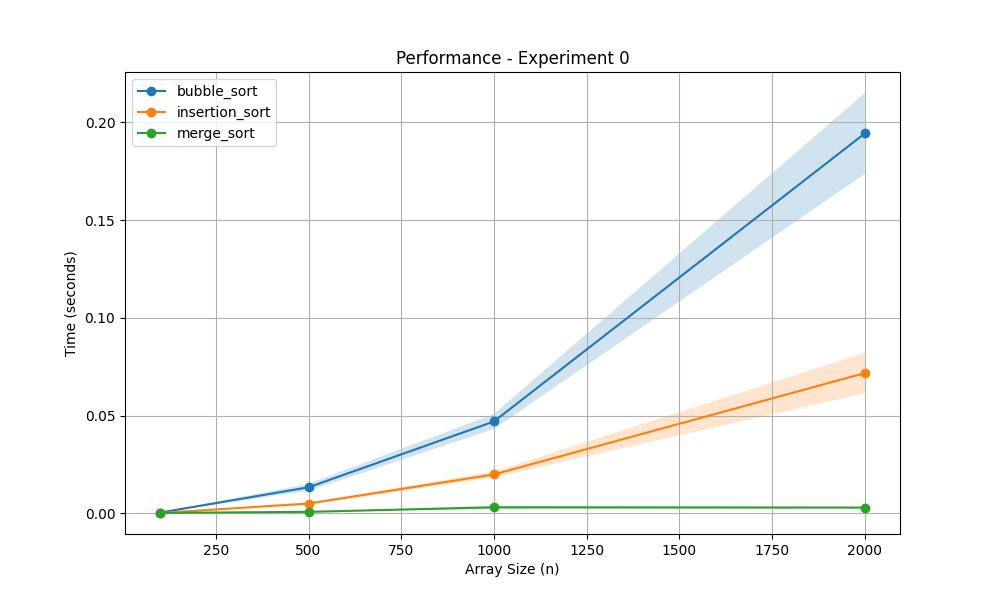
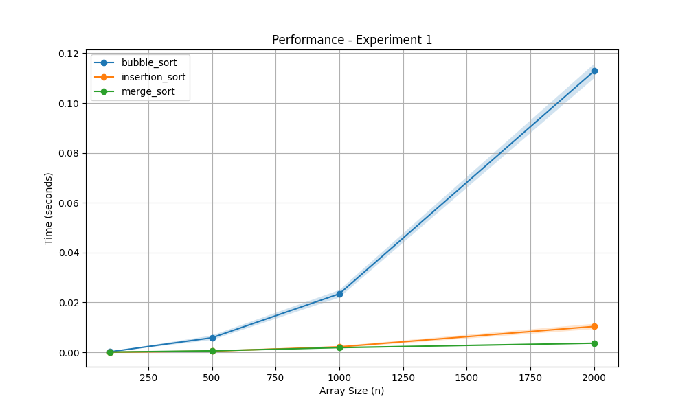

# sorting algorithms performance comparison

Student Name: Matan Izraeli

## selected algorithms
1. Bubble Sort
2. Insertion Sort
3. Merge Sort

---

## Part B - Random Arrays Experiment

**Explanation:**
This plot shows the runtime performance of the three algorithms on fully random arrays. As  expected, Bubble Sort and Insertion Sort exhibit a quadratic growth rate ($O(n^2)$), causing their running times to increase rapidly as the array grows. Merge Sort maintains a much more efficient $O(n \log n)$ time complexity, which is reflected in its nearly flat growth curve on this scale.

---

## Part C - Nearly Sorted Arrays Experiment (5% Noise)

**Explanation of Changes:**
In this experiment, the arrays were initially sorted, but 5% random noise (swaps) was added. 
* **Insertion Sort** showed a big performance improvement compared to the random experiment. Its running time dropped drastically because Insertion Sort is highly efficient on nearly sorted data (approaching its $O(n)$ best-case complexity), as the inner `while` loop rarely needs to shift elements.
* **Merge Sort** remained highly efficient and consistent, as its divide-and-conquer method does not depend on the initial order of the elements.
* **Bubble Sort** remained slow. since this is a standard implementation, it still executes all theoretical comparisons ($O(n^2)$) regardless of the array's initial partial order.